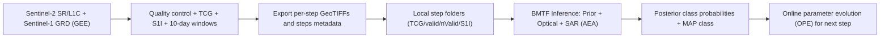

# BMTF Open-Source Code (Manuscript Version)

This folder contains the manuscript-oriented implementation for:

- Satellite data preparation and export in **Google Earth Engine (GEE)**
- **BMTF** (Bayesian Multi-source Temporal Fusion) recursive inference in Python

The implementation is organized to make method logic clear for paper readers and reviewers.

## Data Availability

Related data are available at [https://doi.org/10.5281/zenodo.20371725](https://doi.org/10.5281/zenodo.20371725).

## Folder Structure

```text
BMTF/
鈹溾攢 LICENSE
鈹溾攢 CITATION.cff
鈹溾攢 .gitignore
鈹溾攢 gee/
鈹? 鈹斺攢 01_prepare_10day_dataset.js
鈹溾攢 python/
鈹? 鈹溾攢 requirements.txt
鈹? 鈹溾攢 example_config.json
鈹? 鈹溾攢 README.md
鈹? 鈹溾攢 run_bmtf.py
鈹? 鈹斺攢 bmtf/
鈹?    鈹溾攢 __init__.py
鈹?    鈹溾攢 config.py
鈹?    鈹溾攢 io.py
鈹?    鈹溾攢 sar.py
鈹?    鈹斺攢 model.py
鈹溾攢 examples/
鈹? 鈹斺攢 minimal_dataset/
鈹?    鈹溾攢 README.md
鈹?    鈹溾攢 metadata/
鈹?    鈹? 鈹斺攢 steps_metadata.csv
鈹?    鈹溾攢 STEP_00_YYYYMMDD_YYYYMMDD/
鈹?    鈹? 鈹斺攢 README.md
鈹?    鈹斺攢 STEP_01_YYYYMMDD_YYYYMMDD/
鈹?       鈹斺攢 README.md
鈹斺攢 CODE_MAP.md
```

## Workflow Diagram



## Recommended Workflow

1. In GEE, run [`gee/01_prepare_10day_dataset.js`](gee/01_prepare_10day_dataset.js) to export:
   - `TCG.tif`
   - `valid.tif`
   - `nValid.tif`
   - `S1I.tif`
   - `RGB.tif`
   - `steps_metadata.csv`
2. Organize local files by step folder:
   - `STEP_00_YYYYMMDD_YYYYMMDD/TCG.tif`, etc.
3. Run Python inference:
   - `python run_bmtf.py --data-root <your_data_root> --out-dir <your_output_dir> --config python/example_config.json`

## Minimal Example Directory

See [`examples/minimal_dataset`](examples/minimal_dataset/README.md) for the minimal input directory schema expected by `python/run_bmtf.py`.

## Citation Intent

This code folder corresponds to the manuscript methodology chapters:

- Section 2: Data preparation and time-window organization
- Section 3: BMTF recursive Bayesian updating + AEA + OPE

See [`CODE_MAP.md`](CODE_MAP.md) for equation-to-code mapping.

