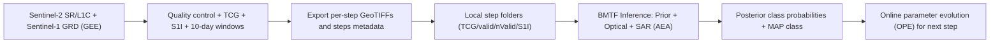

# BMTF Open-Source Code (Manuscript Version)

This folder contains the manuscript-oriented implementation for:

- Satellite data preparation and export in **Google Earth Engine (GEE)**
- **BMTF** (Bayesian Multi-source Temporal Fusion) recursive inference in Python

The implementation is organized to make method logic clear for paper readers and reviewers.

## Data Availability

Related data are available at [https://doi.org/10.5281/zenodo.20371725](https://doi.org/10.5281/zenodo.20371725).
The Zenodo dataset is released under **CC BY 4.0**.

## License

This repository is licensed under the **Creative Commons Attribution 4.0 International (CC BY 4.0)** license.
See [LICENSE](LICENSE) or [https://creativecommons.org/licenses/by/4.0/](https://creativecommons.org/licenses/by/4.0/).

## Folder Structure

```text
BMTF/
|-- LICENSE
|-- CITATION.cff
|-- .gitignore
|-- gee/
|   `-- 01_prepare_10day_dataset.js
|-- python/
|   |-- requirements.txt
|   |-- example_config.json
|   |-- README.md
|   |-- run_bmtf.py
|   `-- bmtf/
|       |-- __init__.py
|       |-- config.py
|       |-- io.py
|       |-- sar.py
|       `-- model.py
|-- examples/
|   `-- minimal_dataset/
|       |-- README.md
|       |-- metadata/
|       |   `-- steps_metadata.csv
|       |-- STEP_00_YYYYMMDD_YYYYMMDD/
|       |   `-- README.md
|       `-- STEP_01_YYYYMMDD_YYYYMMDD/
|           `-- README.md
`-- CODE_MAP.md
```

## Workflow Diagram



## Recommended Workflow

1. In GEE, run [`gee/01_prepare_10day_dataset.js`](gee/01_prepare_10day_dataset.js) to export:
   - `TCG.tif`
   - `valid.tif`
   - `nValid.tif`
   - `S1I.tif`
   - `RGB.tif`
   - `steps_metadata.csv`
2. Organize local files by step folder:
   - `STEP_00_YYYYMMDD_YYYYMMDD/TCG.tif`, etc.
3. Run Python inference:
   - `python run_bmtf.py --data-root <your_data_root> --out-dir <your_output_dir> --config python/example_config.json`

## Minimal Example Directory

See [`examples/minimal_dataset`](examples/minimal_dataset/README.md) for the minimal input directory schema expected by `python/run_bmtf.py`.

## Citation Intent

This code folder corresponds to the manuscript methodology chapters:

- Section 2: Data preparation and time-window organization
- Section 3: BMTF recursive Bayesian updating + AEA + OPE

See [`CODE_MAP.md`](CODE_MAP.md) for equation-to-code mapping.
